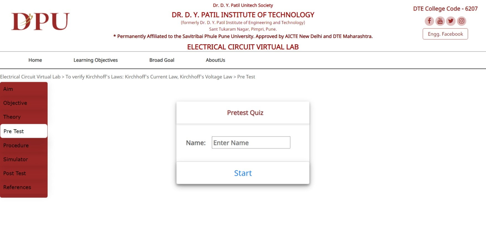
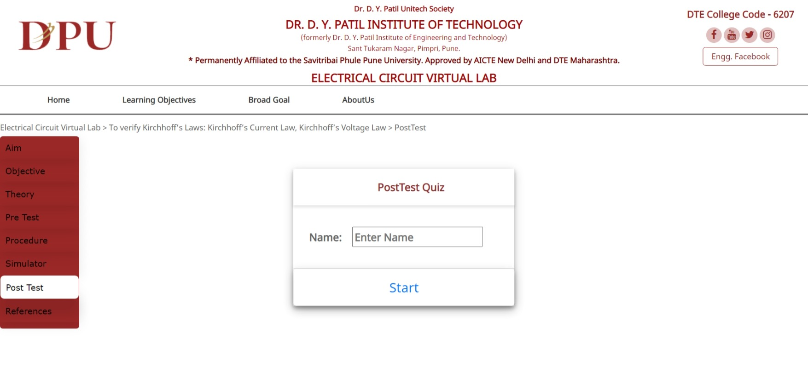

## Experiment 1
## Aim 
>To verify the Kirchhoff’s voltage law and Kirchhoff’s current law for the given circuit.

## Objective
* To measure voltage and current in a DC circuit for each element.
* To calculate analytically V and I.
* Compare analytical and practical values.
* Verify KCL and KVL.
* To apply concepts of KCL and KVL in network theorems.
## Theory

## PreTest

## Procedure
> [Click here to see](theoryimage/Procedure.pdf)

## Simulator
>Designed for interactivity

## PostTest

## References
### Books:
    1. Resnick, Robert et.al. Physics. New York: Wiley, 2002.
    2. Electric circuits- David A.Bell, Oxford University press, Seventh Edition 2009.
    3. IIT-JEE Physics- S.P.Arya, MTG Books, 2007.
    4. Serway, Raymond et.al. College Physics. Australia: Thomson Brooks/Cole, 2006.
    5. University Physics, Revised Ed, Harris Benson, Wiley-India, 2008
### Webliography:
    1. Wikipedia
    2. Matrix operations. [ http://en.wikipedia.org/wiki/LU_decomposition ]
    3. Graph theory.[ http://en.wikipedia.org/wiki/Graph_theory ]