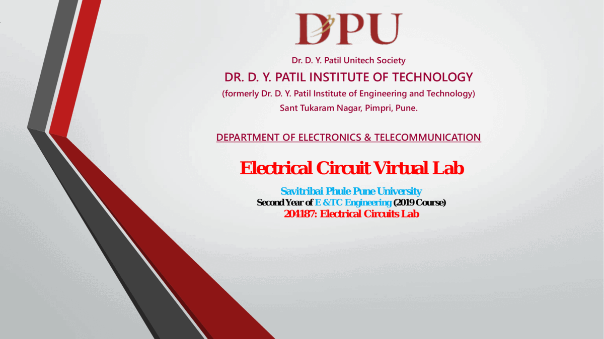
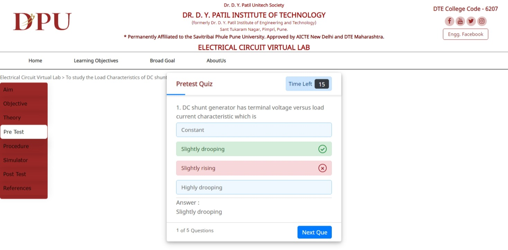
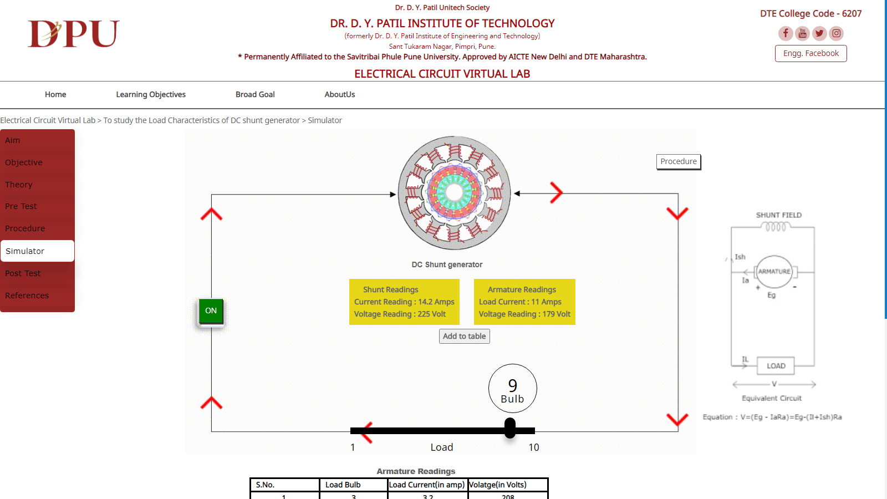
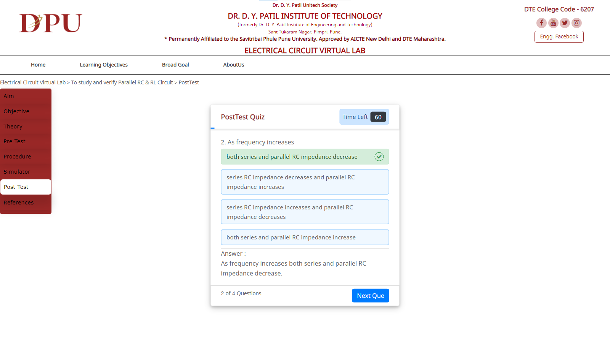

## Experiment 3
## Aim 
>To study the load characterstics of DC Shunt Generator.
Draw the internal characteristics and external characteristics under different loading condition.

## Objective
* To understand DC Shunt Motor.
* To write DC Shunt Motor Load Characteristics.
* To determine internal and external characterstics of DC Shunt generator.
  
## Theory
>

## PreTest
>

## Procedure
> [Click here to see](theoryimage/Procedure.pdf)

## Simulator
>

## PostTest
>

## References
### Books:
    1. Resnick, Robert et.al. Physics. New York: Wiley, 2002.
    2. Electric circuits- David A.Bell, Oxford University press, Seventh Edition 2009.
    3. IIT-JEE Physics- S.P.Arya, MTG Books, 2007.
    4. Serway, Raymond et.al. College Physics. Australia: Thomson Brooks/Cole, 2006.
    5. University Physics, Revised Ed, Harris Benson, Wiley-India, 2008
### Webliography:
    1. Wikipedia
    2. Matrix operations. [ http://en.wikipedia.org/wiki/LU_decomposition ]
    3. Graph theory.[ http://en.wikipedia.org/wiki/Graph_theory ]